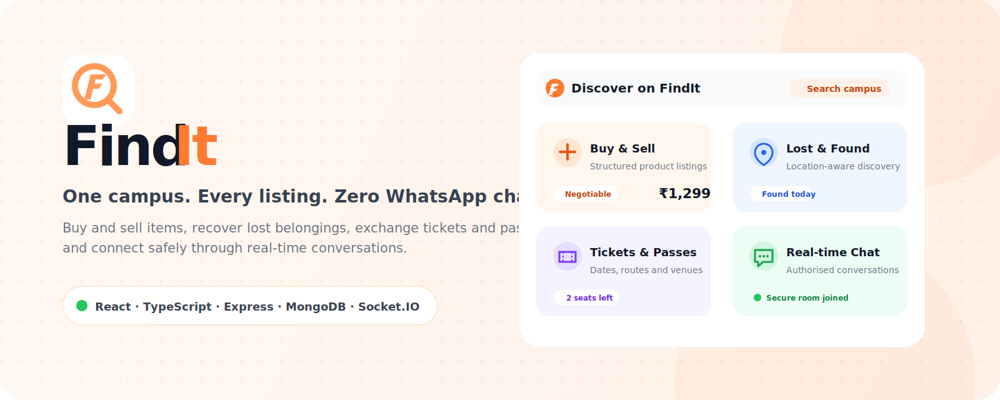
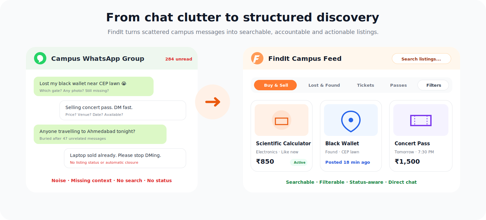
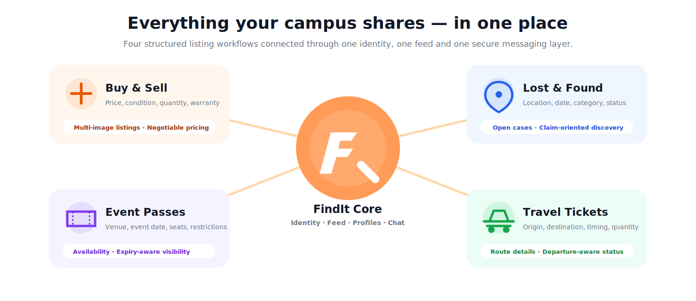

 

### One Campus. Every Listing. Zero WhatsApp Chaos.

A secure, searchable and real-time platform for  
**Buy & Sell · Lost & Found · Event Passes · Travel Tickets**

 

---

## The Problem

Campus communities often depend on WhatsApp groups to report lost belongings, sell used products, exchange travel tickets and find event passes.

Although convenient for casual communication, WhatsApp becomes inefficient when used as a marketplace:

- Important posts are buried beneath unrelated messages.
- Listings lack consistent details such as price, location, quantity or status.
- Users cannot properly search, sort or filter available posts.
- Sold products and expired tickets continue circulating.
- Lost-and-found reports become difficult to recover after a few hours.
- Buyer–seller conversations are mixed with public group traffic.

  

## The Solution

**FindIt** replaces scattered group messages with a structured campus marketplace.

Users can publish detailed listings, explore category-specific feeds, apply relevant filters and communicate privately with listing owners through authenticated real-time chat.

The result is a platform that makes campus exchange:

> **Organised. Discoverable. Secure.**

---

## Platform Modules

  

| Module | What users can do |
|---|---|
| **Buy & Sell** | List products with images, price, quantity, condition, negotiability, usage and warranty information |
| **Lost & Found** | Report found belongings with category, location, date, description, images and case status |
| **Event Passes** | Publish passes with event name, venue, date, price, quantity and age restrictions |
| **Travel Tickets** | List tickets with origin, destination, departure, arrival, ticket type, quantity and price |

---

## Key Functionalities

### Authentication and profiles

- Institutional email registration and OTP verification
- Email/password and Google authentication
- Forgotten-password and password-reset workflows
- JWT access and refresh-token handling
- Protected frontend routes and backend endpoints
- Profile editing, password change and avatar management
- Personal listing management and account deletion

### Listings and discovery

- Four specialised listing categories
- Multiple-image uploads through Cloudinary
- Search, category filtering and price filtering
- Paginated and status-aware feeds
- Detailed listing pages and seller information
- Create, update, delete and availability controls
- Automatic handling of sold, closed or expired listings

### Real-time communication

- Listing-specific one-to-one conversations
- Authenticated Socket.IO connections
- Participant-authorised conversation rooms
- Text and image messages
- Unread-message indicators
- Mark-as-read, delete and report actions

### User experience

- Responsive desktop and mobile interface
- Light and dark themes
- Loading skeletons and empty states
- Reusable components and protected navigation
- Smooth animations and interaction feedback

---

## Technology Stack

| Layer | Technologies |
|---|---|
| **Frontend** | React, TypeScript, Vite, Tailwind CSS, Framer Motion |
| **Backend** | Node.js, Express.js |
| **Database** | MongoDB Atlas, Mongoose |
| **Authentication** | JWT, Firebase Authentication, email OTP |
| **Real-time** | Socket.IO |
| **Media** | Cloudinary, Multer |
| **Email** | Nodemailer |
| **Security** | Helmet, CORS, bcrypt, validation and rate limiting |

### Why this stack?

**React and TypeScript** provide a component-based, responsive and type-safe frontend.

**Node.js and Express** support modular REST APIs while integrating naturally with Socket.IO for real-time communication.

**MongoDB and Mongoose** provide flexible schemas for the different information required by products, found items, passes, tickets, conversations and messages.

**Firebase, JWT and OTP verification** support secure and flexible account access, while **Cloudinary** manages optimised image storage and delivery.

### Find it. Get it. Done.

**Built to make campus exchange organised, discoverable and secure.**

