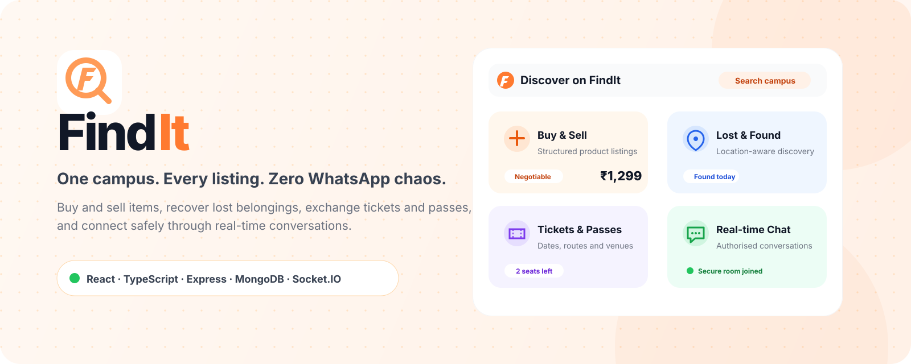

<div align="center">



<br>

### One Campus. Every Listing. Zero WhatsApp Chaos.

A secure, searchable, real-time, and AI-powered platform for  
**Buy & Sell · Lost & Found Radar · Event Passes · Travelling Tickets**

<br>


</div>

---

## 📌 The Problem

Campus communities often depend on informal WhatsApp or Telegram groups to report lost belongings, sell used textbooks/gadgets, exchange travel tickets, and find concert passes.

Although quick for casual chat, messaging groups break down as a campus marketplace:

- **Buried Information**: Important listings are quickly buried beneath Hundreds of unrelated messages.
- **Unstructured Posts**: Missing essential details like price, location, condition, warranty, or availability.
- **No Search or Filters**: Users cannot sort by branch, category, price, or location.
- **Outdated Feed**: Sold items and expired event passes continue circulating indefinitely.
- **Lost & Found Delays**: Misplaced items reported hours ago are impossible to locate.
- **Privacy & Safety Risks**: Public group chats mix personal phone numbers and private conversations with public traffic.

---

## 🚀 The Solution

**FindIt** replaces chaotic messaging groups with a structured, verified, and intelligent campus platform.

Students sign up with their institutional `@dau.ac.in` email address to access dedicated modules, real-time location-tagged lost-and-found radar, fair-price ticket exchanges, authenticated peer chat, and an integrated AI Assistant (**GetIt**).

> **Organised. Discoverable. Verified. Intelligent.**

---

## ✨ Platform Features & Modules

### 1. 🎨 Modern Glassmorphic Landing & Auth Experience
- **Interactive Hero & Showcase**: Floating top glass header with navigation, dynamic hero status badge, and theme switcher.
- **Interactive Feature Explorer**: Live tabbed previews of *Buy & Sell*, *Lost & Found Radar*, *Passes & Tickets*, and *Verified Campus Network*.
- **Live Metrics Counter**: Real-time stats display (12,500+ verified students, ₹8.5L+ saved, 98.4% recovery rate).
- **Verified Student Auth**: Institution email OTP verification (`@dau.ac.in`), Google OAuth, password reset, and secure JWT session management.

### 2. 🛍️ Buy & Sell (Dorm & Academic Marketplace)
- **Rich Media Listings**: Upload up to multiple high-res product photos via Cloudinary.
- **Comprehensive Details**: Specify price, condition, usage duration, warranty status, negotiability, and course/branch relevance.
- **Advanced Discovery**: Multi-filter search (category, price range, condition, branch/semester).
- **Saved & Wishlist Items**: Bookmark listings for quick access.

### 3. 🔍 Campus Lost & Found Radar
- **Location-Tagged Recovery**: Tag lost or found items with precise campus landmarks (Library, Canteen, Auditorium, Reading Rooms).
- **High-Match Confidence**: Automated matching indicators to pair reported lost items with found reports.
- **Ownership Verification**: Integrated safety checks before returning belongings to verified owners.

### 4. 🎟️ Event Passes & Travel Ticket Exchange
- **Fair-Price Enforcement**: Ensures passes and tickets are traded at face value to eliminate scalping.
- **Instant Digital QR Transfer**: Secure student-to-student pass transfer.
- **Travel Shuttle Exchange**: Swap weekend travel tickets for home visits.

### 5. 💬 Authenticated Real-Time Chat & Notifications
- **Private Peer Conversations**: One-to-one Socket.IO chat linked directly to specific listings.
- **Unread Counters & Typing Indicators**: Instant feedback and read state indicators.
- **Notification Center**: Drawer for real-time order/item alerts, broadcast announcements, and campus emergency alerts.

### 6. 🤖 GetIt AI Assistant (Rufus-Powered Campus Companion)
- **Semantic & Multimodal Search**: Natural language understanding powered by GroqCloud AI.
- **Active Page Sensing**: Inspects active item details to answer questions on negotiability, specs, and warranty.
- **Dynamic Category Styling**: Visual tab themes change dynamically based on active categories.
- **Voice Dictation & 1-Click Actions**: Web Speech API voice input, spec comparison, and instant seller chat shortcuts.

### 7. 🛡️ Comprehensive Admin Control Panel
- **Analytics Dashboard**: Visual platform metrics powered by Recharts (user growth, category trends, transaction volume).
- **Moderation & Safety Tools**: Manage users, audit listings, resolve reported items, broadcast announcements, and issue campus emergency alerts.

---

## 🛠️ Technology Stack

| Layer | Technologies |
|---|---|
| **Frontend** | React 19, TypeScript, Vite, Tailwind CSS v4, Framer Motion, Radix UI |
| **Backend** | Node.js, Express.js |
| **Database** | MongoDB Atlas, Mongoose ODM |
| **Authentication** | Institutional Email OTP, Firebase Auth, Google OAuth, JWT |
| **Real-time Engine** | Socket.IO |
| **AI Assistant** | GroqCloud API (Rufus architecture), Zod |
| **Media Storage** | Cloudinary, Multer |
| **Email Service** | Nodemailer |
| **Security** | Helmet, CORS, bcrypt, Express Rate Limit |

---

## ⚙️ Getting Started & Local Development

### Prerequisites
- **Node.js** (v18 or higher)
- **npm** or **yarn**
- **MongoDB** (Local instance or MongoDB Atlas cluster)

### 1. Clone the Repository
```bash
git clone https://github.com/your-username/findit.git
cd findit
```

### 2. Configure Backend Environment
Navigate to `backend/` and create a `.env` file:
```env
PORT=5000
MONGO_URI=mongodb://localhost:27017/findit
JWT_SECRET=your_jwt_secret_key
REFRESH_TOKEN_SECRET=your_refresh_secret_key
EMAIL_USER=your_email@gmail.com
EMAIL_PASS=your_email_app_password
CLOUDINARY_CLOUD_NAME=your_cloud_name
CLOUDINARY_API_KEY=your_api_key
CLOUDINARY_API_SECRET=your_api_secret
GROQ_API_KEY=your_groq_api_key
```

### 3. Install Dependencies & Start Services

**Backend:**
```bash
cd backend
npm install
npm run dev
```

**Frontend:**
```bash
cd frontend
npm install
npm run dev
```

Open `http://localhost:5173` in your browser to explore **FindIt**.

---

<div align="center">

### Find it. Get it. Done.

**Built to make campus exchange organised, discoverable, secure, and intelligent.**

</div>